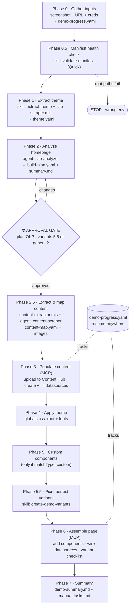

# Sitecore build-demo — pipeline diagram

Visual companion to [`sitecore-build-demo.md`](./sitecore-build-demo.md). Shows the phase flow,
which agent/skill/script each phase uses, key inputs → outputs, and the two points where the
pipeline stops for the SE.

## Pipeline (ASCII)

```
                        SITECORE BUILD-DEMO PIPELINE
         input: client homepage screenshot (required) + URL (optional)
     ════════════════════════════════════════════════════════════════════

   ┌─ PHASE 0 · Gather inputs ──────────────────────────────────────────┐
   │  you provide  : client name, full-page screenshot, URL             │
   │  validates    : Content Hub creds (credentials.local.yaml)         │
   │  writes       : demo-progress.yaml   ◄── source of truth / resume  │
   └────────────────────────────────────────────────────────────────────┘
                                  │
   ┌─ PHASE 0.5 · Manifest health check ────────────────────────────────┐
   │  skill  : sitecore-validate-manifest (Quick)                       │
   │  checks : config sync · 7 root paths · React files · component-map │
   │  gate   : root paths FAIL → STOP (wrong environment)               │
   └────────────────────────────────────────────────────────────────────┘
                                  │
   ┌─ PHASE 1 · Extract brand theme ────────────────────────────────────┐
   │  skill  : sitecore-extract-theme   tool: site-scraper.mjs (Playwright)
   │  in     : screenshots + extracted-styles.json + meta.json          │
   │  out    : themes/<client>.theme.yaml  (navy/gold, fonts, radius…)  │
   └────────────────────────────────────────────────────────────────────┘
                                  │
   ┌─ PHASE 2 · Analyze homepage ───────────────────────────────────────┐
   │  agent  : site-analyzer                                            │
   │  reads  : screenshot + component-registry.yaml + theme-mapping     │
   │  does   : section-by-section match → component + best variant      │
   │           variant-gap analysis · apiAddable classification        │
   │  out    : build-plan.yaml  +  build-plan-summary.md                │
   └────────────────────────────────────────────────────────────────────┘
                                  │
            ╔═════════════════════▼═════════════════════════╗
            ║   ⛔ APPROVAL GATE  (mandatory — STOP)         ║
            ║   Q1 "Build plan correct? Approved?"           ║
            ║   Q2 "Pixel-perfect variants (5.5) or generic?"║
            ╚═════════════════════╤═════════════════════════╝
                                  │ approved
   ┌─ PHASE 2.5 · Extract & map content ────────────────────────────────┐
   │  tool  : content-extractor.mjs (--download-images)                 │
   │  agent : content-scraper  (DOM → fields, translate → English)     │
   │  out   : content-map.yaml  +  images/  +  image-manifest.json     │
   └────────────────────────────────────────────────────────────────────┘
                                  │
   ┌─ PHASE 3 · Populate content  (MCP writes) ─────────────────────────┐
   │  1 upload images → Content Hub (upload-to-content-hub.mjs)         │
   │  2 create client datasource items  "<Client> - <Component>"       │
   │  3 populate fields (text + links + DAM image XML, one call)       │
   │  4 create children (list components)                              │
   │  ⟳ per-section status tracked in demo-progress.yaml               │
   └────────────────────────────────────────────────────────────────────┘
                                  │
   ┌─ PHASE 4 · Apply theme ────────────────────────────────────────────┐
   │  paste :root block into globals.css (above @layer base)           │
   │  add   : Google Fonts <link> in layout.tsx                        │
   │  → all components pick up var(--brand-*) on next restart          │
   └────────────────────────────────────────────────────────────────────┘
                                  │
   ┌─ PHASE 5 · Build custom components ── (only if matchType: custom) ──┐
   │  skill : create-simple / list / context-only  → template+rendering│
   └────────────────────────────────────────────────────────────────────┘
                                  │
   ┌─ PHASE 5.5 · Pixel-perfect variants ── (if approved in Q2) ────────┐
   │  skill : sitecore-create-demo-variants                            │
   │  out   : <Client> named export per component (TSX)                │
   │          + Variant Definition item in Sitecore                    │
   └────────────────────────────────────────────────────────────────────┘
                                  │
   ┌─ PHASE 6 · Assemble the page  (MCP writes) ────────────────────────┐
   │  1 use existing Home page (default)                               │
   │  2 add_component_on_page  (build order, sequential)               │
   │  3 set_component_datasource → client items from content-map       │
   │  4 generate variant-checklist.md  (variants = manual, API can't)  │
   │  context-only (NavHeader/Footer) → manual in partial designs      │
   └────────────────────────────────────────────────────────────────────┘
                                  │
   ┌─ PHASE 7 · Summary ────────────────────────────────────────────────┐
   │  out : demo-summary.md · manual-tasks.md · variant-checklist.md   │
   │  SE finishes: set variants · wire header/footer · restart · deploy│
   └────────────────────────────────────────────────────────────────────┘

   ─────────────────────────────────────────────────────────────────────
   LEGEND   ⛔ stop-and-ask gate   ⟳ per-section progress tracking
   AGENTS   site-analyzer · content-scraper
   SKILLS   extract-theme · validate-manifest · create-*-component ·
            create-demo-variants
   SCRIPTS  site-scraper · content-extractor · upload-to-content-hub (.mjs)
   THREAD   demo-progress.yaml records every phase/section → enables
            "resume demo" from the last incomplete step
```

## Pipeline (Mermaid)



## Two control points to remember

- **Approval gate after Phase 2** is the single most important stop — no Sitecore items are
  created until the SE approves the build plan and the Phase 5.5 (pixel-perfect vs generic)
  decision. Skipping it caused rework in the Eurobank build.
- **Variants are always manual** (Phase 6) — the Agent API cannot set rendering parameters, so
  the pipeline emits `variant-checklist.md` for the SE to apply in the Pages editor.

## Artifacts produced (in `docs/ai/demos/<client-kebab>/`)

| File | Purpose |
|------|---------|
| `demo-progress.yaml` | phase/section status — enables "resume demo" |
| `build-plan.yaml` / `build-plan-summary.md` | section → component + variant mapping |
| `content-map.yaml` | client content mapped to Sitecore field names |
| `images/` + `image-manifest.json` | source images + Content Hub IDs / upload status |
| `variant-specs.yaml` | per-section visual analysis (Phase 5.5) |
| `demo-summary.md` | start-here build overview |
| `manual-tasks.md` / `variant-checklist.md` | remaining SE steps |
